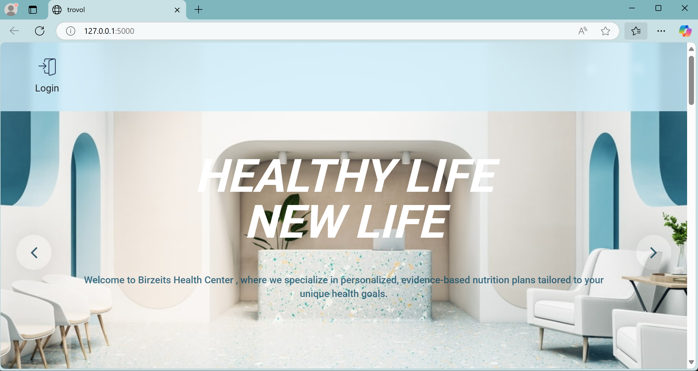

#  Nutrition Centre Management System  

The **Nutrition Centre Management System** is a **web-based application** designed to efficiently manage and organize data for a **nutrition centre**. The system is built using **Python Flask** for the backend, **MySQL** for database management, and a **HTML-based GUI** for user interaction.  

The system allows the centre to store, update, and query data related to **patients, diet plans, nutritionists, and appointments**, making it an essential tool for streamlined operations.  

## **Features**  

✔ **Patient Management** – Add, update, and delete patient records.  
✔ **Diet Plan Management** – Store and modify customized diet plans for patients.  
✔ **Nutritionist Database** – Maintain a list of available nutritionists and their schedules.  
✔ **Appointment Scheduling** – Book and manage patient appointments with nutritionists.  
✔ **Data Queries & Reports** – Perform database queries to retrieve essential information.  
✔ **User Authentication** – Secure login for staff and administrators.  
✔ **Responsive Web Interface** – Clean and simple HTML-based GUI.  

## **Implementation Details**  

The project follows a **Flask-MVC architecture**, with separate layers for **routing and database operations**.  

- **Backend:** Python Flask – Handles requests, processes data, and connects to MySQL.  
- **Frontend:** HTML, CSS, JavaScript – Provides an interactive user interface.  
- **Database:** MySQL – Stores all patient, diet, and appointment data.  

## **How to Run the Project**  

1. Set up the MySQL database by creating a new database and importing the provided SQL file.  
2. Configure the MySQL connection details in the Flask application.  
3. Run the Flask application to start the server.  
4.Open a web browser and access the system through the provided local URL, to view the following website:

 

## Contact

For any inquiries, reach out via:

- Email: [miar.taweel04@gmail.com](mailto\:miar.taweel04@gmail.com)
- GitHub: [miarTaweel](https://github.com/miarTaweel)

